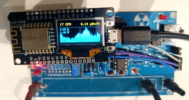
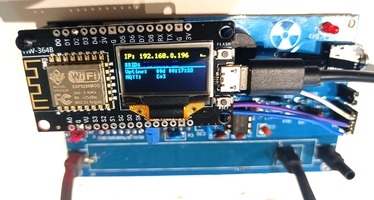
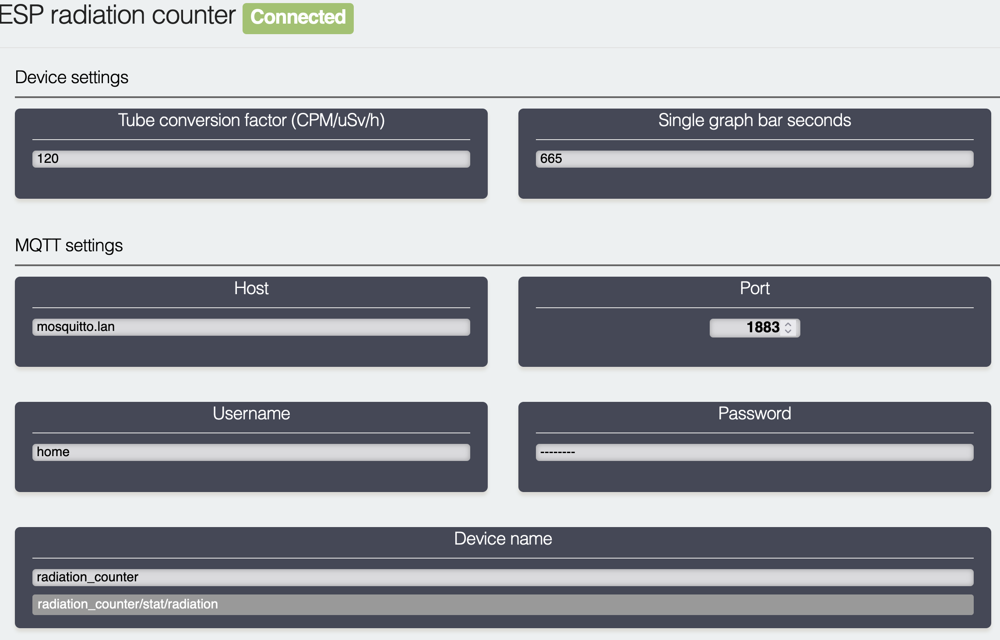
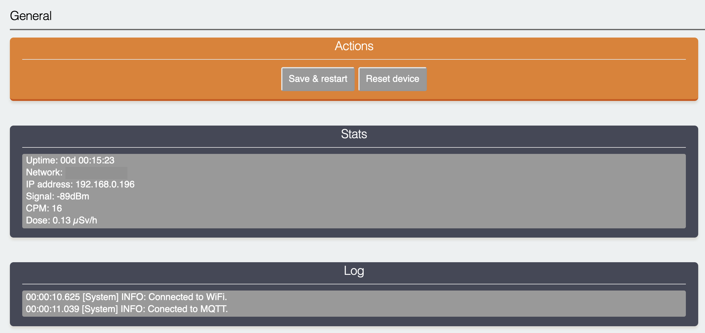
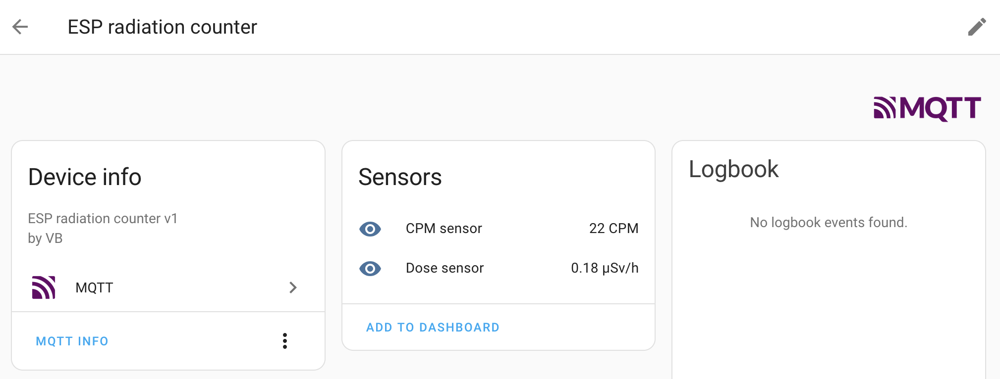

# esp-radiation-counter-gateway

Bridges GGreg20_V3, RadiationD-v1.1 (CAJOE), etc. radiation detectors to MQTT.
Provides MQTT device for easy HomeAssistant integration.

Two-page display with scrolling by `FLASH` button.

 

## Wiring

ESP8266 is capable of providing 3.3V (`3V` Pin) and 5V (`VU` Pin) to power the detector board itself, 
but you can separate voltages if you like, just remember to connect a shared ground.

Signal should go to pin `D2`.

## Setup

### Access point

OLED display will show you the name of the WiFi you should connect and setup the network. By default it is `ESP_radiation_counter`.

### Web UI

When you've configured the WiFi and the device restarted, navigate to the IP address to access the WEB UI.
The IP address should be displayed on the OLED.

* `Tube conversion factor` - Tube-dependant value, for `J305` its around `123` and for `CBM-20` its ~ `175`.
* `Single bar graph seconds` - how much seconds should one graph bar represent (on OLED). 665s ~ 11min results in 24 hours of historical bar graph on the display.

* MQTT:
  * (required) Host & Port
  * (optional) Username & Password
  * `Device name` - is used to construct the MQTT topic where measurements will be sent

* `Save & restart`

### HomeAssistant

HomeAssistant should automatically detect the configuration and create device with sensors.

